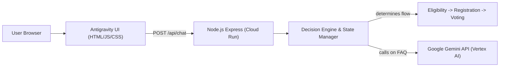

# 🗳️ Interactive Election Navigation Assistant

## 🚩 Problem

Understanding the election process is often confusing for first-time voters and the general public. Information is fragmented, static, and difficult to follow, leading to low awareness and engagement.

---

## 💡 Solution

This project introduces an **Interactive Election Navigation Assistant** — a guided, decision-based system that helps users understand the election process step-by-step.

Instead of acting like a generic chatbot, the system:

* Guides users through a structured flow
* Adapts responses based on user input
* Explains each step clearly and interactively
* Uses Google Gemini AI gracefully to handle out-of-bounds questions (FAQs)

---

## 🏗️ System Architecture



---

## 🧠 Key Features

### ✅ Eligibility Checker
* Determines if a user is eligible to vote
* Provides clear next steps if not eligible

### 🔄 Guided Voting Flow
* Step-by-step journey: **Start → Eligibility → Voter ID → Vote → Done**
* Interactive UI with dynamic option buttons, progress bar, and journey summary.

### 📊 Timeline Visualization
* Displays key election phases with descriptions.

### 🧩 Decision Engine (Core Innovation)
* Rule-based system controlling user flow.
* Normalizes synonyms (e.g. accepts "yes", "yeah", "yep", "sure", "no", "nah").
* Ensures logical and consistent responses.
* Reduces dependency on AI for critical decisions (faster, cheaper, predictable).

### 🤖 AI-Powered FAQ
* Uses Google Gemini API (`gemini-2.0-flash`).
* Handles open-ended user queries dynamically with retry logic and fallbacks.

### 🛡️ Production & Security Hardened
* Uses Helmet for HTTP headers and CSP.
* Input validation & sanitization against XSS.
* Scalable Cloud Run configuration (`--concurrency=1`, `--min-instances=1`).

---

## ⚙️ Tech Stack

* **Frontend:** Antigravity UI (HTML, JS, CSS)
* **Backend:** Node.js (Express)
* **AI Integration:** Google Gemini API
* **Deployment:** Docker & Google Cloud Run

---

## 📦 Local Setup

### 1. Clone Repository

```bash
git clone <your-repo-link>
cd <repo-name>
```

### 2. Backend Setup

```bash
cd packages/backend
npm install
```

Create a `.env` file (see `.env.example`):
```bash
cp .env.example .env
```
Edit `.env` and add your `GEMINI_API_KEY`.

Run backend:
```bash
npm start
```
*The backend will run on http://localhost:3000*

### 3. Frontend Setup

The Express backend automatically serves the frontend on the same port! Just open your browser to:
[http://localhost:3000](http://localhost:3000)

---

## 🧪 Testing

We use Jest and Supertest for comprehensive test coverage.

```bash
cd packages/backend
npm test
```
*Runs the backend unit test suite with coverage report (tests validate decision engine paths, state manager, validation, and API routes).*

### End-to-End Playwright Tests
From the root directory:
```bash
npm install -D @playwright/test
npx playwright install
npx playwright test
```
*Runs E2E interaction tests simulating user flow through the frontend.*

---

## ☁️ Cloud Deployment Configuration

This app is optimized for Google Cloud Run deployment via the included `cloudbuild.yaml` and `Dockerfile`.

### Current vs Recommended Settings (Implemented)

| Setting | Configuration | Benefit |
| --- | --- | --- |
| `concurrency` | `1` | Prevents race conditions with in-memory session state |
| `min-instances` | `1` | Reduces cold-start latency |
| `max-instances` | `3` | Prevents infinite scaling & controls cost |
| `memory` | `256Mi` | Optimized for a lightweight Node.js Express server |
| `CMD` | `node index.js` | Skips npm overhead for faster startup time |

---

## 🔐 Security Practices Implemented

* **Helmet Middleware**: Configures security headers including `Content-Security-Policy`.
* **Input Validation**: Strips HTML tags, restricts payload size, validates UUID format.
* **CORS Limitation**: Configurable same-origin enforcement.
* **X-Powered-By Disabled**: Hides Express server signature.

---

## 🚀 Future Improvements

* Real-time election data integration.
* Multi-language support.

---

## ☁️ Backend Integrations Added

* **Firebase Firestore**: We use Firebase Admin to store session details and state in Firestore, enabling multi-container state sharing and horizontal scaling.
* **Gemini Caching**: Requests to Gemini are cached with a TTL to prevent redundant requests.
* **Rate Limiting**: Protects against abuse via Express rate limits.
* **CI/CD Pipeline**: Automated tests and deployment via GitHub Actions (`ci.yml`).

---

## 🏁 Conclusion

This project transforms complex election processes into an **interactive, user-friendly experience** by combining:

* Rule-based deterministic decision logic.
* AI-powered assistance.
* Production-ready deployment constraints.
