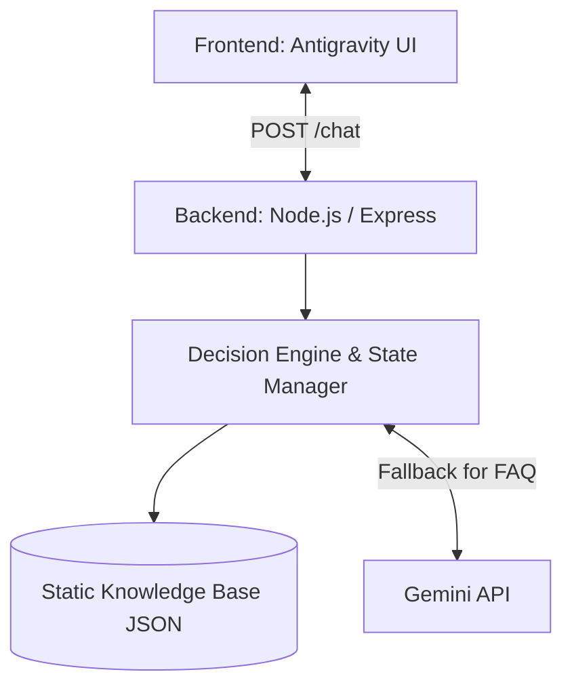

# System Architecture

## 1. Overview
A hybrid architecture featuring a lightweight backend that orchestrates between an intelligent rule-based engine and the Google Gemini API.

## 2. High-Level Diagram

## 3. Components

### 3.1 Frontend (Presentation Layer)
- **Role**: Render UI, capture user input (text & buttons), render timelines.
- **Tech**: HTML, Vanilla CSS (Antigravity framework logic), Vanilla JavaScript.
- **State**: Ephemeral UI state. Relies on backend for logic state.

### 3.2 Backend API (API Layer)
- **Role**: Express Server handling stateless (or minimal state) HTTP requests.
- **Tech**: Node.js, Express, CORS, environment variables configuration.

### 3.3 Decision Engine (Logic Layer)
- **Role**: Parses user input, matches against current expected state, retrieves next state from knowledge base.

### 3.4 State Manager (Persistence Layer)
- **Role**: Tracks user session.
- **Tech**: In-memory map (UUID -> UserState).

### 3.5 External Integrations
- **Gemini Service**: Axios-based wrapper to call Gemini API when the user's intent falls outside rigid rules (e.g., FAQ).

## 4. Scalability & Deployment
- Deploy Node.js server via Docker or direct execution.
- Frontend hosted as static files generated or dynamically served by Express.
- State is in-memory for MVP, can migrate to external DB (e.g., Firebase) later.
